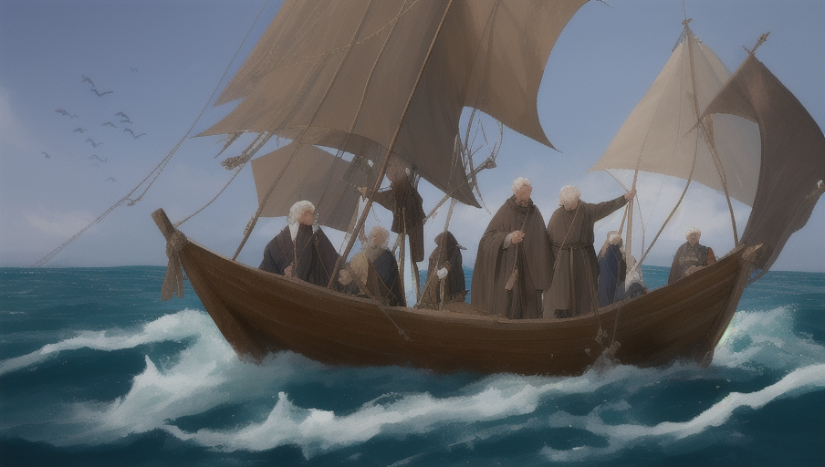

有一個主教搭一艘船出發前往所羅維茲寺。在同一艘船上還有一群朝聖者，也是要到那個地方去。

海風輕搖著白帆，海浪慵懶的擺盪，主教輕鬆的到甲板上散步。

他看見一些人圍著一個老漁夫，聚精會神的聽他說話，而那個漁夫手指著前方的小島，嘰哩呱啦的，不知道在說些什麼。主教好奇的上前去，想聽他們說話。可是他一接近，那一群人馬上就安靜下來，並起立脫帽，對主教行禮。

主教說:「真不好意思，打斷你們的談話。請告訴我，你們在談些什麼?」主教在一張板凳上坐了下來。

一個人回答:「漁夫告訴我們，有三個隱士住在那座小島上，他們為了要使他們的靈魂得救，所以在那座島上修行。」

「哪一座島?」

「就在雲下方，有一坨黑影，那就是了。」

主教定睛用力往前方瞧，可是海面的金光閃個不停，主教什麼也沒看見。

「我看不到。你們可以再告訴我隱士的事嗎?」主教說。

這時漁夫回答了:「他們都是聖人。這幾年，我常聽到有關他們的傳說，可是我一直到去年才親眼見到他們。」漁夫接著講起遇見隱士的經過。

那時候，漁夫出海打魚，漁船被海浪沖上小島，撞散了，回不去。正當漁夫不知如何是好時，他走到一間泥屋前，遇見了隱士。隱士除了拿東西給漁夫吃，還幫他修好漁船。

「隱士長什麼樣子?」主教問。

「有一位個子小小的，有些駝背，身上穿著教袍，看起來年紀很大，我敢說他有一百歲了。他老得連白鬍子都有些發青呢。可是他的面容好和藹，老是帶著笑容，臉上還發著光，像是天使一樣。另一位，年紀也很大，身上穿著破爛不堪的外套，黃灰色的鬍子多而茂密，身體非常強壯。

他憑一隻手就可以把我的船翻過去。不過他也很親切，滿臉的笑容。」

漁夫繼續說:「還有一位，很高，留了一把雪白的鬍子，長到他的膝蓋。他看起來很頑固，粗粗的眉毛像一把彎刀。他上身沒穿衣服，只用一條破草蓆圍在腰上。

這三位隱士幾乎不說什麼話，他們都用眼神彼此交談。」

當他們說著的時候，船越來越接近小島了。一位商人大喊:「就在那裏，現在可以看得很清楚了。」

主教朝商人手指的方向望去，果真看見了一座小島。

主教很想到那座島上見那三位隱士，於是他跟船長要求把船開往小島。可是船長聽了，臉色不太好看。「可以是可以，不過這樣我們會浪費很多時間。而且，我們的船不能太靠近那座島，到時候，您得划小船過去。主教，那三位老先生實在沒什麼好看的。他們根本是三個傻蛋。」

「我還是想去看看。」主教說，「你幫我準備小船，我會負擔所有的費用。」

既然主教都這麼說了，船長當然得答應嘍!

船長調整好帆的方向，舵手拉起船舵，於是船往小島前進。船長還在船頭擺了一張椅子，讓主教坐下來。

船越來越靠近小島，視力好的人已經可以看到島上的小泥屋，再過一會兒，便有人看到了三個隱士。船長用望遠鏡一看，然後又遞給主教。果真沒錯，島上是有三個人，一個高一個壯，一個矮小，又彎腰駝背。

他們手牽著手站在岸邊。

船長轉身對主教說:「船只能開到這邊。再過去，水就太淺了。我們在這裏下錨，您就乘小船上岸吧!」

水手們接著把一艘小船放到海面上，一個水手跳上小船後，水手們又把繩梯丟下船，讓主教沿著梯子爬到小船上。等其他兩個水手都上了船，他們就向小島出發。

幾個人合力划船，船一下子就到了小島。他們看到那三個人真的是手牽手站在岸邊，就跟漁夫形容的一模一樣。

主教下船後，老人急忙向主教俯身鞠躬。然後主教便按手在他們頭上，為他們祝福。三個老人高興的把頭壓得更低了。

主教對老人說:「我聽說您們三位在這裏修行，並為世人禱告。我是神卑微的僕人，我的工作就是為神教導並看顧衪的兒女。因此我來拜訪您們，看看您們是否有任何需要。」

三個老人相視而笑，但還是不說話。

「可不可以告訴我?您們在這個島上怎麼為我們的神工作，又用什麼方法使您們的靈魂得救呢?」主教問。

「我們不知道如何為神工作，我們只是自己養活自己而已。」老人說。

「那您怎麼向神禱告呢?」

「喔，我們都是這樣禱告，」三個老人同時把頭抬向天空，齊聲說，「三位一體的神，求您憐憫保守我們三位。」

主教笑了笑，說:「您們對三位一體的神還有點認識。不過，禱告的方式不太對。在聖經上，神有教導人們該怎麼禱告。」

主教繼續對老人們解釋三位一體的聖父、聖子、聖靈。

「聖子主耶穌基督降到人間，拯救世人，並教人向神禱告。現在我就教您們主的祈禱文。仔細聽，並跟著我唸:我們在天上的父，…………………….」

「我們在天上的父。」三個老人都大聲跟著唸。體型壯碩的老人唸得很正確;但是，年紀最大的老人，牙齒幾乎快掉光了，所以唸得很模糊;另一個個子高的老人，因為鬍子太長了，一開口就吃到自己的鬍子，所以他也唸得不清不楚。但是他們都很努力，也很認真，還唸得很快樂。

於是主教就在島上待了好久，反覆不停的教這三個老人唸祈禱文，一句又一句，直到他們其中一位全唸懂了，而且記熟為止，好讓他可以繼續教其他兩位老人。

天就要黑了，月亮也已經從水面露出臉來。主教起身準備離開，三個老人趕緊跪下謝謝主教。主教回頭扶起三位老人，親吻他們之後，才坐上小船。

主教坐上小船後，還一直聽到三位隱士大聲背誦祈禱文的聲音。一直到主教上船之前，三位隱士的身影在金黃的夕陽餘暉中，還依稀可見。主教一登上大船，船錨就被拉起，風帆也放了下來，這艘大船又繼續開往朝聖之路。

主教在船尾的甲板上找個位子坐下來，他看著小島，想著剛剛的事，然後看著小島消失在淡紫色的暮色中。

船上的朝聖者都躺下休息了。甲板上一片寧靜。主教還不想睡，他想到剛剛三個老人高興的笑容，想著他們專心背誦祈禱文的神情，就覺得好滿足，並感謝神派遣他去做這樣一件神聖、有意義的事。

海面上，月光隨著波浪起舞。突然，遠方出現一個白色的光團。是一群海鳥嗎?還是某艘船的白帆被月光照得發亮?主教定睛看著，卻還是看不出那是什麼。

「如果是一艘帆船，那它前進的速度也太快了吧。」主教想。

主教站起來，對舵手說:「請你看看，那是什麼?………….那是…………」話才剛說，主教已經看清楚，原來是那三個隱士，正用比船還快的速度在海面上前進。他們全身發光，白鬍子也閃爍著光芒。舵手一看，嚇得放開船舵，大叫:「是三個隱士在海上跑!」

船上的乘客聽到這荒謬的事，全都驚醒，並跑到船尾目睹這神奇的事。

三個隱士其實不是用跑的，而是一路滑行過來的。他們一到船邊，就喊著說:「神的僕人，我們又忘了您教的祈禱文。本來我們一直唸都還記得，沒想到，一停下來，就忘了。請再教我們吧!」

主教合起雙手，俯身說:「三位聖人，神已經聽見您們的禱告。我並不能教您們什麼。請為我們這些罪人禱告吧!」

隱士一聽，又轉身從海上回去。

在他們消失的地方，出現一道光，直到太陽昇起時，那道光才消失不見。

&&&&&&&&&&&&&&&&&&&&&&&&&&&&&&&&&&&&&&&&&

「你們禱告，不可像外邦人，用許多重複的話。他們以為話多了必蒙垂聽。你們不可效法他們。因為在你們沒有祈求之前，你們所需的，天父早已經知道。」

(馬太福音六章:7-8節)

原著:托爾斯泰(Leo Nikolayevich Tolstoy) 

俄國最偉大的小說家

    