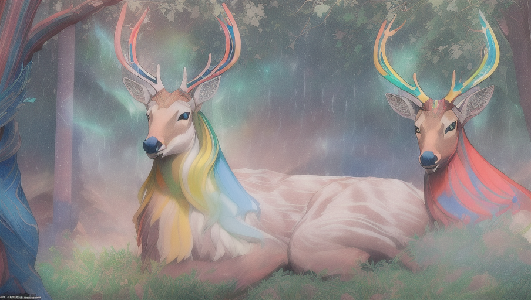

(一)
很久很久以前，在一座深山裡住著一群性情溫和的鹿。 由於這座山林，遠在重山峻嶺中，很少有人往來，因而保持著山野原始的清幽和祥和。
 瞧！ 湖水清澄，幾隻白天鵝在水中悠遊著，透藍的天空底下，只見蝴蝶兒飛舞，小蜜蜂忙探蜜。 在這翠綠的草地上，鹿群們正啃食著青草，這兒烏語花香，就如仙境般的美麗。
 在這一群安祥與世無爭的鹿中，有一隻昂首首而立，有著高向貴情操的鹿王。 鹿王的頭頂上長著漂亮的犄角，牠身上的毛閃亮著九種柔和的色彩。 
牠，就是人們傳說中，美麗而高貴的九色鹿。
(二)
有一天，鹿王和牠的鹿群們正在湖畔小憩。忽然之間，一向平靜的湖水起了漣漪，原本在湖中戲水的天鵝，驚恐的拍打著翅膀…鹿王的好朋友烏鴉飛 來警告：「啊！鹿王，有人闖進來了！」
「別驚慌！」鹿王豎起耳朵仔細判斷。 鹿王靜聽了一會，果然發現有異樣的聲音來自湖泊的湖面。 這時候，鹿群們似乎都發現有了危機，紛紛聚集，母鹿帶著小鹿緊張的望著湖面。
烏鴉又來報告：「鹿王，有一個人在湖的上游。」
鹿王立刻下命令：「母鹿和小鹿們退到林子裡去。」
一會兒，湖裡的人頭出現了，這人載浮載沉並且斷斷續續發出求救：「救命啊…………..救命……………」
「啊！這人快要淹死了，我去救他上來！」鹿王看著不忍心。
烏鴉在鹿王身邊飛來飛去的，牠很著急的勸鹿王：「鹿王要救這個人？人類對你是有危險的呀！」
「這……」鹿王沉思了幾秒鐘：「他快要溺死了，再不救他就要來不及了。」鹿王說著，就奮不顧身的涉入水中去救人了。
鹿王高大的身體漸漸沒入湖中，鹿群們緊張的看著鹿王泅向溺水的人，又將那人駝在背上，然後遊回岸來。 湖邊，除了鹿群們，還有天鵝，烏鴉等都在爲鹿王捏一把冷汗呢，大家都在爲鹿王的安全擔心哪！ 
鹿王將溺水的人翻身俯臥，使腹中積水吐出來，因而救活了這個不幸溺水的人。 但是，也可以說，他是一個幸運的溺水人，因爲他遇到了鹿王，才不至於溺死呢!!原來這個溺水的人，在山上砍柴的時候，一不小心滾落到山崖，掉進一個急流中去，又被水沖入鹿王居住的湖泊來。
鹿王稱呼溺水的人爲「溺人」，並把他留在身邊療傷，每天請他喝鹿奶，直到他的體力完全恢復。 溺人很感激鹿王的救命之恩，長跪在鹿王跟前叩謝：
「鹿王啊！我願意終身做奴僕來服侍您，爲您探集嫩草，我要報答您的救命之恩。」 
「鹿王搖搖頭說：「我不要你做我的奴僕呀！你可以回到你自己的家去。」
溺人很誠懇的說：「那麼我要如何來報答鹿王的救命之恩呢？  」
「啊！我不要你報答呀！不過，請你答應一件事。」
「是什麼事呢？」溺人詫異的問。  「你回去以後，千萬不要告訴別人我住在這兒啊！」
「爲什麼呢？」
鹿王長長嘆息一聲，很憂鬱的樣子：「唉！正因爲我身上有九種顏色的鹿毛，這是 稀世珍寶哇！人人都想得到呢！」
溺人聽了馬上上明白，應道:
「哎呀！請放心吧！就是有人給黃金珠寶，我也不會出賣鹿王的呀！」
「眞是這樣嗎？連黃金也不要嗎？」
「鹿王啊！若不是你救了我，我早就溺死了呀！」溺人再三叩頭說：「放心吧！無論在何種情況下，我都會保守祕密的呀！我發誓，如果 我出賣了我的救命恩人，一定會遭到上天的懲罰。」
鹿王相信了溺人，溺人也就謝別了鹿王，離開這美麗的山林，回到自己溫暖的家。 
(三)
國王的寵妃，做了一個奇怪的夢，她夢見一隻美麗的鹿，牠身上有九種絢麗的色彩，鹿角白如雪。 第二天，妃子就把她的夢告訴國王，並且要求國王：「陛下，聽說世界上僅有一隻九色鹿，我在夢中看到牠的皮毛眞是漂亮極了！我要用牠的 皮毛來做一件大衣，用鹿角做一把梳子。」
國王回答：「既然愛妃想得到九色鹿，那麼我就派人去捉拿九色鹿吧！」「妃子聽了很開心：「 陛下，我想這一定是世界上最珍貴的一皮裘了。」國王立刻派出大隊人馬，搜捕九色鹿。
過了很久，國王派出去尋找九色鹿的人都陸續回來了，但一是他們都空手而返。 沒有人知道九色鹿住在哪裡，也沒有人能夠找到牠。
國王的寵妃聽說找不到九色鹿，失望極了。
於是國王就在城牆上貼出懸賞的告示：如果有人知道九色一鹿的下落，可以得到一金碗的銀栗子和一銀碗的金栗子。
 （四）
有一天，那個曾經被鹿王所救的人進城來了，當他看到國王的告示後，立刻就知道那隻救了他性命的鹿王，正是國王要搜捕的九色鹿。
「喲！一碗的金栗子和銀栗子啊！」溺人心中喑自歡喜。 
「就在這同時，溺人的良知也在告訴他：「那是不義之財，鹿王對我有救命之恩啊！」
隨後又想：「嘻嘻！有了金栗子和銀栗子，我再也不用辛辛苦苦的砍柴了！」
溺人想著黃金的好處，反而忘了他今天可以活著，是因爲一鹿王將他從湖中救了起來的緣故啊！
最後，溺人完全被利慾沖昏了頭，他想要金栗子和銀栗子，他決定要去見國王，他終於破壞了他自己的承諾。 這個時候，溺人的臉上長出一顆一顆的小膿瘡來，溺人覺得臉上又癢又痛。  
(五)
溺人也不顧臉上會痛的小瘡，還是四處打聽國王和皇后出城狩獵的日子，然後，他等候在山路上。
國王和皇后乘著白色駿馬拉著的豪華馬車，馬車前後都簇擁著士兵和宮女。 
溺人在山路間攔截國王的馬車，跪著向國王告密：「偉大的國王！世界上有一隻美麗的九色鹿啊！是唯一的一隻啊！」
「咦！你見過九色鹿嗎 ？」國王有些懷疑的看著眼前這個人。
「見過呀！」溺人撒謊：「我因爲打獵而追逐過九色鹿呢！」「那麼，你也知道牠住在哪裡囉！」
「這個……這個……」
國王看溺人說話忽然吞吞吐吐起來，覺得有些奇怪，這個人是不是想來騙黃金的？  「你儘管說，只要說對了，金銀財寶就是你的了，君無戲言。」
「是……」溺人聽到黃金，就緊張得冒冷汗：「九色鹿……牠住在一座深山中。」「哈！哈！我眞的要得到九色鹿了！」國王開心得大笑起來。
溺人一顆心忽然忐忑不安起來，他該不該帶國王去找九色鹿呢？ 很快地，他貪婪的心佔據了理智，滿腦子裡裝的都是黃金，再也沒有多餘的空間來思考其他的問題。
溺人就爲著黃金，爲國王的車隊帶路，往那寧靜的山谷去。 
哎呀！ 當國王的士兵抵達時，鹿王正高枕無憂地在熟睡當中呢，牠以爲沒人會找到這個深遠的山谷中來，牠相信溺人許下的諾言，牠絕對想不到，就是那個被牠從水裡救起來的人出賣了牠。
 （六）
國王在很遠的山頭，就看見了這隻美麗而高貴的九色鹿，牠身上的皮毛果然閃著九種絢麗的色彩，漂亮極了。
國王乘鹿王在沉睡中，命士兵們悄悄接近牠，國王要活捉九色鹿。
當鹿王的好朋友烏鴉發現敵人來了，十分的著急，烏鴉在空中長鳴，爲鹿王報警，怎奈鹿王竟然熟睡不醒。 烏鴉也顧不得牠自己的安全，從空而降，停在鹿王的頭上，牠去啄鹿王的耳朵，鹿王仍然不醒，呀！ 敵人越來越接近了，烏鴉啄了右耳又去啄左耳，嘴裡叨唸著：「鹿王，拜託！拜託！快醒醒吧！」鹿王這才從夢中驚醒，然而國王的士兵 已悄然接近了，鹿王的情況十分的危急。 這時鹿王很從容的站立起來，命令母鹿：
「快！快帶著小鹿躲進森林中去。」
「不，大王，我們不能留下你呀！」母鹿哭泣著不肯離開鹿王。
「快走啊！去保護小鹿要緊呀！」
「不！……………」
其他的鹿也不肯獨自逃生，牠們留下來與鹿王共存亡。鹿王看見國王的士兵逼進了，牠更著急啦！  「你們快逃命吧！留在這裡也只有白白犧牲性命了！」
「要死我們也要死在一起。」母鹿堅持著生死相隨，不肯去逃命。這時候，國王的士兵們手拿弓箭圈攏過來啦……。
（七）
這是鹿王的生死關頭，當國王與鹿王相對時，鹿王卻昂首一挺胸，一點也不畏懼死亡。皇后這時候，也下得馬車來看九色鹿，她讚嘆：「唷！好漂亮的鹿啊！牠的犄角多麼美麗啊！」
鹿王抬頭問國王：「是誰告訴國王，我在這兒的？是誰？是誰啊？」 國王回答：「是黃金呀！是我出了賞金的呀！」這時鹿王瞥見一個人閃閃躲躲的藏在國王的身後。 鹿王心中暗想：「咦！那人不就是曾經落水，快要淹死的人嗎？」
唔！ 現在，所有的疑問，鹿王都完全明白了，便對國王說：
「我被你們逮住了，我輸了，但是國王啊！我在臨死前，要講一個故事給你聽。」國王點點頭：「好！我喜歡聽故事，我正在洗耳恭聽呢！」
「鹿王挺起胸膛，理直氣壯的向國王陳述：
「國王啊！我曾經在這個湖裡救過一個溺水的人，我的好朋友烏鴉忠告我，不可救人類，因爲人類總是要殺害我們，可是那個人就要溺死了，如果我還是不救他，怕是要來不及了，我就涉入湖中，把他馱上岸來;後來我們讓他喝鹿奶養傷，等他完全康復時，他就長跪在我面前，說要做我的奴僕，他要終身來服侍我，我不要他報答我，我要他趕快回家 ，我只要他爲我守秘密，不要告訴別人我住在這裡就好。」
「那人答應了嗎？」國王迫不及待的問。 
鹿王答：「那個溺水的人說過，就是黃金珠寶他也不會出一賣我的。」
聰明的國王表情嚴肅地說：「你被出賣啦！」
「是的。」國王聽了 也很生氣，再問：「那人是誰？」
「他就是恩將仇報，出賣我來領取國王黃金的人啊！」國王聽了非常憤怒，立刻命士兵將那告密者抓了起來，並且很生氣地指責告密者：
「九色鹿是你的救命恩人，你不但不報答牠，還要出賣一牠，你這是不仁不義啊！」
告密者這時候羞愧得垂下頭，但是他的臉上，頭頂和身上已經長出更多的膿瘡來，口吐惡臭，站在他旁邊的人都趕快避開。 
國王又命士兵放了鹿王，並對鹿王說：
「你曾經不顧自己的危險，去救一個溺水的人，你有功於我們人類，我將要詔告天下，不准任何人再來殺害九色鹿。」
國王的寵妃也被九色鹿救人的義行所感動，決足以後再也不穿鹿皮做的衣裳。
國王又將這個山林劃爲保護區，不准人們獵鹿。
從此鹿王和他的鹿群，在那美麗而安靜的山林裡，眞正過著安定，快樂的日子。
